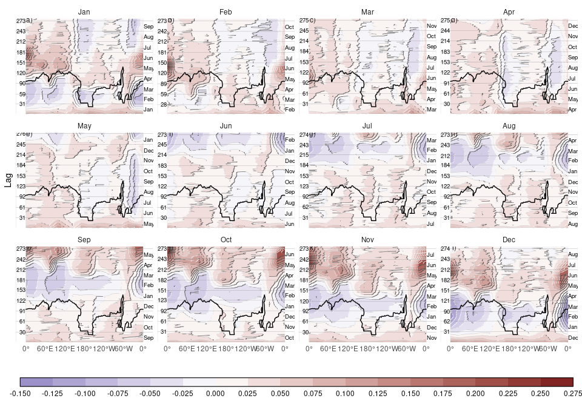

# Untitled

\IfFileExists{pdfcomment.sty}
{
  \usepackage{pdfcomment}
  \newcommand{\criticmarkupadd}[1]{\pdfmarkupcomment[markup=Highlight,color={0.838431  0.913725  0.734902}]{##1}{}}
  \newcommand{\criticmarkuprm}[1]{\pdfmarkupcomment[markup=Highlight,color={0.887059  0.673725  0.673725}]{##1}{}}
  \newcommand{\criticmarkupmark}[1]{\pdfmarkupcomment[markup=Highlight,color={1  0.99216  0.21961}]{##1}{}}
  \newcommand{\criticmarkupcomm}[1]{\pdfcomment[icon=Comment, color={0.89804  0.69020  0}]{##1}}
}{

  \newcommand{\criticmarkupadd}[1]{\{++{##1}++\}}
  \newcommand{\criticmarkuprm}[1]{\{-{}-{##1}-{}-\}}
  \newcommand{\criticmarkupmark}[1]{\{=={##1}==\}}
  \newcommand{\criticmarkupcomm}[1]{\{>{}>{##1}<{}<\}}
}


# Introduction

Unlike Arctic sea ice, which has been steadily retreating at least since
the start of satellite records in the early 80s, Antarctic sea ice had a
slightly increasing trend that models systematically failed to reproduce
and puzzled researchers (Hobbs et al. 2016). Then, in 2016 Antarctic sea
ice extent dropped precipitously and has been at low and record low
levels since, highlighting even more our lack of understanding of
Antarctic sea ice variability and change. \[ref: that CESM run with
forced winds\].

Antarctic sea ice is in a remote location but the potential impacts of
its variability and trends extend far into the lower latitudes,
affecting ocean and atmospheric circulation, ocean carbon uptake and
biological processes. It’s likely that a reduction in sea ice extent
would reduce the temperature gradient between high and low latitudes
(and vice versa), which in turn influences the strength and location of
the eddy-driven jet, which is a crucial component of weather events. For
the northern hemisphere, it has been hypothesised that the reduction in
sea ice in the northern hemisphere has lead to a weaker, wavier jet,
increasing the frequency of extreme events (Barnes and Screen 2015).
There is some evidence of this effect in the Southern Hemisphere. Models
show a weakened vortex in the middle atmosphere, increased vertical wave
flux and greater zonal wave 1 amplitude in Springs following a low sea
ice maximum. But models don’t fully agree on the exact phase of the
zonal wave response and observations don’t show a clear signal (Rea et
al. 2024). The jet response to sea ice loss is also very model
dependent, particularly sensitive to its the climatological location (H.
c. Ayres and Screen 2019). It is also small compared with the direct
effect of CO2 increase and Sea Surface Temperature warming (H. c. Ayres
and Screen 2019). On climate scales, it is thought that the signal of a
reduction in Antarctic sea ice is like a “mini global warming” and
experiments also predict a weakening and northerly shift of the
eddy-driven (Raphael, Hobbs, and Wainer 2011; M. England, Polvani, and
Sun 2018; M. R. England et al. 2020; H. C. Ayres et al. 2022).

Correctly modelling Antarctic sea undsen sector and the
Amundsen-Bellingshausen sector (Fice is not only necessary for process
understanding and climate projections to inform adaptation strategies.
Accurate seasonal to subseasonal forecast are crucial for operations in
and around the Antarctic continent Wagner et al. (2020). However,
Antarctic sea ice forecasts have been challenging both due to model
biases and inherent large variability and complexity and it has lagged
behind Arctic sea ice forecasts (Zampieri, Goessling, and Jung 2019).
Dynamical seasonal forecasts of Summer Antarctic sea ice have been shown
to perform worse than relatively simple statistical methods (Massonnet
et al. 2023), which also underscores the need for better understanding
of sea ice dynamics.

{==**S2** Introduce S2==}

{==**Objective.** Evaluate S2.==}

# Data and methods

## ACCESS-S2

ACCESS-S2 (Wedd et al. 2022) is the Australian Bureau of Meteorology’s
current seasonal prediction system that replaced ACCESS-S1 (Hudson et
al. 2017) in October 2021. Both ACCESS-S2 and ACCESS-S1 consist on the
Global Atmosphere 6.0 (GA6) (Williams et al. 2015; J. Waters et al.
2017), Global Land 6.0 (Best et al. 2011; J. Waters et al. 2017), Global
Ocean 5.0 (Madec et al. 2013; Megann et al. 2014) and Global Sea Ice 6.0
\[CICE; Rae et al. (2015)\]. The atmosphere has a N216 horizontal
resolution(~60km in the mid-latitudes) with 85 levels. The land model
uses the same horizontal grid with 4 soil levels. The ocean component
has a 1/4º resolution with 75 vertical levels. The ice component –based
on CICE version 4.1– has the same resolution than the ocean and 5 sea
ice categories as well as an open water category.

Both systems took atmospheric initial conditions derived from
ERA-interim (Dee et al. 2011) for the hindcast and from the Bureau’s
operational analysis for real-time forecasts. The main difference
between the two are the ocean and ice initial conditions. ACCESS-S1
initial conditions came from from the Met Office FOAM system, which uses
a multivariate, incremental three-dimensional variational (3D-Var),
first-guess-at-appropriate-time (FGAT) DA scheme (Jennifer Waters et al.
2015) and assimilates sea surface temperature (SST), sea surface height
(SSH), in situ temperature and salinity profiles, and sea ice
concentration. ACCESS-S2, instead, runs from initial conditions
generated by the in-house data assimilation scheme described in Wedd et
al. (2022). This scheme is a weakly coupled ensemble optimal
interpolation method and assimilates temperature and salinity profiles
from EN4 (Good, Martin, and Rayner 2013) for the hindcast and from the
WMO Global Telecommunication System (GTS) and both the Coriolis and
USGODAE Global Data Assembly Centers (GDACs) for the real-time forecast.
SSTs are nudged to Reynolds OISSTv2.1 (Reynolds et al. 2007) for the
hindcast and to the Global Australian Multi-Sensor SST Analysis (GAMSSA;
Zhong and Beggs 2008) for the real-time forecast in areas where SSTs are
larger than 0ºC. Relevant for this work, sea ice concentrations are not
assimilated.

For evaluation we use hindcast for the period 1981–2023{\>\>Check\<\<}.
Anomalies will be taken with respect to the 1981–2011 climatology
computed from the reanalysis. Climatology is smoothed with a 11 day
running mean.

## Verification datasets

There is not a lot of data on sea ice properties, especially for things
like thickness, age, etc. However there are relatively reliable
satellite-derived estimates of sea ice concentration, which estimates
the proportion of each grid area that is covered with ice.

These data are not perfect. Sensor sensitivity and resolution. Weather
filtering. Land To account for observational uncertainty we performed
the verification on other data sources. We find that the spread among
the different datasets is minimal compared with the difference with the
ACCESS-S2 and ACCESS-S1 forecasts, so the conclusions are independent of
the dataset used.

We use NOAA/NSIDC’s Climate Data Record V4 \[CDR; Meier et al. (2014)\]
as the primary verification dataset. Its sea ice concentration data are
estimated taking the maximum value of the NASA Team \[ref\] and NASA
Bootstrap (Comiso 2023) algorithms to reduce their low concentration
bias (Meier et al. 2014; Meier et al. 2021). Both algorithms use data
from the Scanning Multichannel Microwave Radiometer (SMMR) on the
Nimbus-7 satellite and from the Special Sensor Microwave/Imager (SSM/I)
sensors on the Defense Meteorological Satellite Program’s (DMSP) -F8,
-F11, and -F13 satellites. The data has a resolution of 25 by 25km and
daily from 1978 onwards.

Results based on two other different datasets are provided as
supplementary material:

1.  The NASA Bootstrap (Comiso 2023) product is… it is not an
    independent dataset from NOAA/NSIDC CDRV4.

2.  The European Organisation for the Exploitation of Meteorological
    Satellites (EUMETSAT) Ocean and Sea Ice Satellite Application
    Facility (OSI SAF) \[ref\] is another satellite-derived sea ice
    concentration product based on mostly the same sensors as the NOA
    CDR but computed independently using different algorithms.

## Error measures

For evaluation purposes, we use a series of measures.

### Sea ice extent

Sea Ice Extent is defined as the area of ocean covered with at least 15%
ice. This threshold is motivated by the limitations in satellite
retrieval, which is increasingly unreliable for lower sea ice
conditions.

Sea Ice Extent is a rough global measure, but a model could have
relatively accurate extent of ice but with different distributions. We
use two other measures to account for these errors.

We compute Root Mean Square Error of sea ice concentration anomalies.

We also compute the Integrated Ice Edge Error (IIEE) (Goessling et al.
2016). This is defined as the area in which the model misspredicts sea
ice concentration being above or belong 15% ice. That is, dichotomise
sea ice concentration into areas with more and less than 15% sea ice
both in the forecast and observations; the IIEE is the area in which
forecast and observations differ.

# Results and discussion

## Reanalysis

### Bias


[Figure 1](#fig-hindcast-extent) a shows the seasonal cycle of Sea Ice
Extent for the ACCESS-S2 hindcast and NOAA/NSIDC CDRV4 ACCESS-S2 shows a
severe low extent bias, especially in the late summer-early autumn. This
is due primarily to a faster and longer melt season between January and
March and slower growth during March and April This is then balanced
with faster growth between May and July ([Fig. 2](#fig-mean-growth)).
Many S2S systems exhibit this systematic underestimation during the sea
ice minimum and early freezing season (Massonnet et al. 2023) and could
indicate problems in the representation of thermodynamics in the model
(Zampieri, Goessling, and Jung 2019).

Comparing ACCESS-S2 with ACCESS-S1, the latter has a smaller bias,
especially at low lags ([Fig. 1](#fig-hindcast-extent)) even though the
typical growth rates are very similar between both models
([Fig. 2](#fig-mean-growth)). At larger lags, ACCESS-S1’s bias in summer
and autumn is very similar to ACCESS-S2’s. This suggests that this lower
sea ice state is closer to the models’ equilibrium, indicating that it
is an issue with model formulation that was being corrected by the data
assimilation system in ACCESS-S1.

At long lags, sea ice extent loses most of the initial condition memory
and reverts to the model’s preferred equilibrium state. Therefore we can
estimate the latter using the hindcasts with the largest possible lag,
which is shown in triangles in [Figure 1](#fig-hindcast-extent) for the
same dates as the initial conditions. The difference between the two is
the effect of the data assimilation.

The equilibrium of ACCESS-S1 and ACCESS-S2 is very similar (comparing
the triangles in each panel in [Fig. 1](#fig-hindcast-extent)), owing to
both having the same model formulation. From June to October, in
ACCESS-S2 circles move away from triangles and towards observations,
indicating that the information from the ocean and atmosphere data
assimilation is getting to sea ice and affecting the initial conditions.
The rest of the year, there is little if any difference between circles
and triangles in ACCESS-S2, indicating that almost no data assimilation
is taking place and the sea ice component of the model is virtually
free-running.


[Figure 3](#fig-bias) shows the difference in monthly mean sea ice
concentrations between NOAA/NSIDC CDRV4 and ACCESS-S2 reanalysis. From
October to May, the model underestimates sea ice concentrations pretty
much everywhere there is ice except for the deep Weddell Sea in April
and May, where sea ice concentrations saturate to 1. In winter, the
differences are mostly on the sea ice edge, with slight positive bias in
XXX and negative bias around the Indian Ocean sector.

### Anomalies

{==intro connecting subsections==}


[Figure 4](#fig-extent-anom) shows monthly sea ice extent anomalies
forecasted at selected lags. The anomalies in this case were computed
with respect of the climatology of each lag, which is a way of
bias-correction. Compared with ACCESS-S1, ACCESS-S2 anomaly forecast is
relatively poor even in the first month, which stays relatively skilful
even at lag 3. ACCESS-S2 shows much bigger variability than
observations, with dramatic lows between 1995 and 2007 and highs between
2007 and 2015.

### RMSE

To study ACCESS-S2 forecasts quantitatively, we compute error measures
for all hindcasts started on the 1st of every month.


[Figure 5](#fig-rmse) shows the median and 95% range of RMSE of sea ice
concentration anomalies for ACCESS-S2 forecasts compared with a
benchmark of persistence. This figure uses NOAA/NSIDC CDRV4 data, but
the results are nearly identical compared with ERA5 or Bootstrap. Due to
errors in the initial conditions, it is expected that a persistence
forecast would be better than the model forecast at very short lags, but
that the persistence forecast errors would grow faster and eventually
surpass the mode forecast, at which time is statistically useful {==I’ve
got this from CC at the ICTP summer school and makes sense, but it would
be great to have a reference?= =}. Here the persistence errors are
almost always lower than the ACCESS-S2 forecast, indicating that the
model doesn’t have skill at any lag and in any month. The only exception
is the RMSE around February.



Even though ACCESS-S2 is no better than persistence at forecasting
pan-Antarctic sea ice concentration anomalies, the quality of the
forecast might vary between regions. To analyse the spatial distribution
of the model error, we computed ice concentration RMSE on 15 meridional
slices 24 degrees thick. The median difference between the forecast and
persistence RMSE is shown on [Figure 6](#fig-rmse_lon), where negative
values indicate that the model has lower RMSE than the benchmark.

The skill shown by ACCESS-S2 at February-March forecasts is evident by a
band of negative values across almost all longitudes except around and
east of the Antarctic Peninsula, where most of the Summer ice is left.
This suggests that the positive skill comes from the model correctly
forecasting no ice where there is never ice. However, there are other
regions of skilful forecasts.

Forecasts initialised on January 1<sup>st</sup> ([Fig. 6](#fig-rmse_lon)
panel a) shows RMSE values below persistence at lags larger than 180
days (corresponding to July through September) in the Ross and Weddell
Sea. These two regions are also relatively well forecasted from other
months. Notably, May forecasts of Weddell sea ice concentration
anomalies ([Fig. 6](#fig-rmse_lon) panel e) are skillful after about 20
days and remain so until December. The Weddell sea region is also the
region with the maximum erro –arround June irregardless of
initialisation date.

### Comparison with S1


To compare ACCESS-S2 with ACCESS-S1, we computed the IIEE for both
models. This error measure is shown in [Figure 7](#fig-iiee) for all
lags and forecasts initialised at the first of every month. ACCESS-S1
has lower error at short lags at all months, with the errors converging
as the forecast goes on. The time to convergence depends on the month
and it can be as fas as two weeks June and July to as large as 160 days
for forecasts initialised in February. Since the only difference between
these forecasts are the initial conditions, this timescale is an
indication of the the memory of sea ice to initial conditions; at least
from October to March when the data assimilated form the other
components has little to no influence on sea ice.

Also evident in [Figure 7](#fig-iiee) is the difference in the error
spread at short lags between ACCESS-S2 and ACCESS-S1. In all month
ACCESS-S1 shows a small error spread at lag 1, indicating that the error
in the initial conditions not only is small, but also fairly constant.
This spread then grows towards a climatological spread as errors
accumulate differently in different forecasts. For ACCESS-S2, this is
true only only between July and October, approximately. For all other
months, the error spread is more or less stable throughout the forecast
window, indicating that not only the initial error is high, but it’s not
constant.


The large initial error spread could be due either to large spread of
ensemble members or due to a large spread of individual forecasts.
[Figure 8](#fig-iiee-variance) splits the IIEE variance for each lag
into the mean variance of each individual forecast and the variance of
the mean error of each individual forecast, which adds up to the total
variance. The average variance of each forecast is almost identical
between forecast systems in all months. This shows that the ensemble
spread of individual forecasts evolves identically, which, again, it’s
not unexpected because both systems share the same model formulation.
This also shows that the perturbation scheme in ACCESS-S2 is comparable
to the one in ACCESS-S1.

On the other hand, the spread of the mean error is always larger in
ACCESS-S2 than ACCESS-S1. The difference is particularly large at short
lags in some months, which coindice with the ones in which the data
assimilation scheme is not influencing sea ice initial conditions.

## Conclusions

------------------------------------------------------------------------

We evaluated the sea

The ACCESS-S2 model, the Australian Bureau of Meteorology’s current
seasonal prediction system, shows a significant low extent bias in its
sea ice extent predictions, particularly during late summer and early
autumn. This bias is attributed to a faster and longer melt season
between January and March, and slower growth between March and April.
This underestimation during the minimum and early freezing season is a
common issue in many seasonal-to-subseasonal (S2S) systems, suggesting
potential problems with the model’s thermodynamic representation.

Comparison with the previous ACCESS-S1 model reveals that while both
models share the same formulation and thus similar equilibrium states,
ACCESS-S1 had a smaller bias, especially at shorter forecast lead times.
This difference suggests that the data assimilation system in ACCESS-S1
was correcting for this low sea ice bias. The analysis suggests that the
data assimilation in ACCESS-S2 is only effectively influencing sea ice
initial conditions from June to October, while the rest of the year, the
sea ice component runs virtually free, reverting to its biased
equilibrium state.

Further evaluation of ACCESS-S2’s performance in forecasting sea ice
anomalies reveals a poor performance even at short lead times,
exhibiting much larger variability than observed. Quantitative analysis
using root mean square error (RMSE) of sea ice concentration anomalies
shows that ACCESS-S2 generally lacks skill at any lead time and for any
month, with its performance often worse than a simple persistence
forecast.

Comparison with ACCESS-S1 using the Integrated Ice Edge Error (IIEE)
metric confirms that ACCESS-S1 consistently demonstrates lower errors at
short lead times, with the errors converging between the two models as
the forecast progresses. This convergence timescale, ranging from two
weeks to 160 days depending on the month, is indicative of the sea ice
memory of initial conditions, particularly during October to March when
data assimilation has minimal influence.

Analysis of error spread further reveals that ACCESS-S1 consistently
exhibits a smaller error spread at short lead times, indicating both
smaller and more consistent initial condition errors. While both models
show similar ensemble spread in individual forecasts, likely due to
their shared model formulation and comparable perturbation schemes,
ACCESS-S2 shows a larger spread in the mean error of individual
forecasts, particularly at short lead times when data assimilation is
less influential on sea ice initial conditions.

------------------------------------------------------------------------

# References

<div id="refs" class="references csl-bib-body hanging-indent">

<div id="ref-ayres2019" class="csl-entry">

Ayres, H.c., and J.a. Screen. 2019. “Multimodel Analysis of the
Atmospheric Response to Antarctic Sea Ice Loss at Quadrupled CO2.”
*Geophysical Research Letters* 46 (16): 9861–69.
<https://doi.org/10.1029/2019GL083653>.

</div>

<div id="ref-ayres2022" class="csl-entry">

Ayres, Holly C., James A. Screen, Edward W. Blockley, and Thomas J.
Bracegirdle. 2022. “The Coupled Atmosphere–Ocean Response to Antarctic
Sea Ice Loss.” *Journal of Climate* 35 (14): 4665–85.
<https://doi.org/10.1175/JCLI-D-21-0918.1>.

</div>

<div id="ref-barnes2015" class="csl-entry">

Barnes, Elizabeth A, and James A Screen. 2015. “The Impact of Arctic
Warming on the Midlatitude Jet-Stream: Can It? Has It? Will It?” *WIREs
Climate Change* 6 (3): 277–86. <https://doi.org/10.1002/wcc.337>.

</div>

<div id="ref-best2011" class="csl-entry">

Best, M. J., M. Pryor, D. B. Clark, G. G. Rooney, R. L. H. Essery, C. B.
Ménard, J. M. Edwards, et al. 2011. “The Joint UK Land Environment
Simulator (JULES), Model Description – Part 1: Energy and Water Fluxes.”
*Geoscientific Model Development* 4 (3): 677–99.
<https://doi.org/10.5194/gmd-4-677-2011>.

</div>

<div id="ref-comiso2023" class="csl-entry">

Comiso, J. 2023. “Bootstrap Sea Ice Concentrations from Nimbus-7 SMMR
and DMSP SSM/I-SSMIS. (NSIDC-0079, Version 4).” Boulder, Colorado USA.:
NASA National Snow and Ice Data Center Distributed Active Archive
Center. <https://doi.org/10.5067/X5LG68MH013O>.

</div>

<div id="ref-desilva2020" class="csl-entry">

De Silva, Liyanarachchi Waruna Arampath, Jun Inoue, Hajime Yamaguchi,
and Takeshi Terui. 2020. “Medium Range Sea Ice Prediction in Support of
Japanese Research Vessel MIRAI’s Expedition Cruise in 2018.” *Polar
Geography* 43 (2-3): 223–39.
<https://doi.org/10.1080/1088937X.2019.1707317>.

</div>

<div id="ref-dee2011" class="csl-entry">

Dee, D. P., S. M. Uppala, A. J. Simmons, P. Berrisford, P. Poli, S.
Kobayashi, U. Andrae, et al. 2011. “The ERA-Interim Reanalysis:
Configuration and Performance of the Data Assimilation System.”
*Quarterly Journal of the Royal Meteorological Society* 137 (656):
553–97. <https://doi.org/10.1002/qj.828>.

</div>

<div id="ref-england2020" class="csl-entry">

England, Mark R., Lorenzo M. Polvani, Lantao Sun, and Clara Deser. 2020.
“Tropical Climate Responses to Projected Arctic and Antarctic Sea-Ice
Loss.” *Nature Geoscience* 13 (4): 275–81.
<https://doi.org/10.1038/s41561-020-0546-9>.

</div>

<div id="ref-england2018" class="csl-entry">

England, Mark, Lorenzo Polvani, and Lantao Sun. 2018. “Contrasting the
Antarctic and Arctic Atmospheric Responses to Projected Sea Ice Loss in
the Late Twenty-First Century.” *Journal of Climate* 31 (16): 6353–70.
<https://doi.org/10.1175/JCLI-D-17-0666.1>.

</div>

<div id="ref-goessling2016" class="csl-entry">

Goessling, H. F., S. Tietsche, J. J. Day, E. Hawkins, and T. Jung. 2016.
“Predictability of the Arctic Sea Ice Edge.” *Geophysical Research
Letters* 43 (4): 1642–50. <https://doi.org/10.1002/2015GL067232>.

</div>

<div id="ref-good2013" class="csl-entry">

Good, Simon A., Matthew J. Martin, and Nick A. Rayner. 2013. “EN4:
Quality Controlled Ocean Temperature and Salinity Profiles and Monthly
Objective Analyses with Uncertainty Estimates.” *Journal of Geophysical
Research: Oceans* 118 (12): 6704–16.
<https://doi.org/10.1002/2013JC009067>.

</div>

<div id="ref-hobbs2016" class="csl-entry">

Hobbs, William R., Rob Massom, Sharon Stammerjohn, Phillip Reid, Guy
Williams, and Walter Meier. 2016. “A Review of Recent Changes in
Southern Ocean Sea Ice, Their Drivers and Forcings.” *Global and
Planetary Change* 143 (August): 228–50.
<https://doi.org/10.1016/j.gloplacha.2016.06.008>.

</div>

<div id="ref-hudson2017" class="csl-entry">

Hudson, Debra, Oscar Alves, Harry H. Hendon, Eun-Pa Lim, Guoqiang Liu,
Jing-Jia Luo, Craig MacLachlan, et al. 2017. “ACCESS-S1 The New Bureau
of Meteorology Multi-Week to Seasonal Prediction System.” *Journal of
Southern Hemisphere Earth Systems Science* 67 (3): 132–59.
<https://doi.org/10.1071/es17009>.

</div>

<div id="ref-madec2013" class="csl-entry">

Madec, Gurvan, Romain Bourdallé-Badie, Pierre-Antoine Bouttier, Clément
Bricaud, Diego Bruciaferri, Daley Calvert, Jérôme Chanut, et al. 2013.
“NEMO Ocean Engine,” February. <https://doi.org/10.5281/zenodo.1475234>.

</div>

<div id="ref-massonnet2023" class="csl-entry">

Massonnet, François, Sandra Barreira, Antoine Barthélemy, Roberto
Bilbao, Edward Blanchard-Wrigglesworth, Ed Blockley, David H. Bromwich,
et al. 2023. “SIPN South: Six Years of Coordinated Seasonal Antarctic
Sea Ice Predictions.” *Frontiers in Marine Science* 10 (May).
<https://doi.org/10.3389/fmars.2023.1148899>.

</div>

<div id="ref-megann2014" class="csl-entry">

Megann, A., D. Storkey, Y. Aksenov, S. Alderson, D. Calvert, T. Graham,
P. Hyder, J. Siddorn, and B. Sinha. 2014. “GO5.0: The Joint NERC–Met
Office NEMO Global Ocean Model for Use in Coupled and Forced
Applications.” *Geoscientific Model Development* 7 (3): 1069–92.
<https://doi.org/10.5194/gmd-7-1069-2014>.

</div>

<div id="ref-meier2021" class="csl-entry">

Meier, Walter N., F Fetterer, A. K. Windnagel, and J. Scott Stewart.
2021. “NOAA/NSIDC Climate Data Record of Passive Microwave Sea Ice
Concentration.” Boulder, Colorado USA: National Snow and Ice Data
Center. <https://doi.org/10.7265/efmz-2t65>.

</div>

<div id="ref-meier2014" class="csl-entry">

Meier, Walter N., Ge Peng, Donna J. Scott, and Matt H. Savoie. 2014.
“Verification of a New NOAA/NSIDC Passive Microwave Sea-Ice
Concentration Climate Record.” *Polar Research*, December.
<https://doi.org/10.3402/polar.v33.21004>.

</div>

<div id="ref-rae2015" class="csl-entry">

Rae, J. G. L., H. T. Hewitt, A. B. Keen, J. K. Ridley, A. E. West, C. M.
Harris, E. C. Hunke, and D. N. Walters. 2015. “Development of the Global
Sea Ice 6.0 CICE Configuration for the Met Office Global Coupled Model.”
*Geoscientific Model Development* 8 (7): 2221–30.
<https://doi.org/10.5194/gmd-8-2221-2015>.

</div>

<div id="ref-raphael2011" class="csl-entry">

Raphael, M. N., W. Hobbs, and I. Wainer. 2011. “The Effect of Antarctic
Sea Ice on the Southern Hemisphere Atmosphere During the Southern
Summer.” *Climate Dynamics* 36 (7): 1403–17.
<https://doi.org/10.1007/s00382-010-0892-1>.

</div>

<div id="ref-rea2024" class="csl-entry">

Rea, Divya, Dillon Elsbury, Amy H. Butler, Lantao Sun, Yannick Peings,
and Gudrun Magnusdottir. 2024. “Interannual Influence of Antarctic Sea
Ice on Southern Hemisphere Stratosphere-Troposphere Coupling.”
*Geophysical Research Letters* 51 (15): e2023GL107478.
<https://doi.org/10.1029/2023GL107478>.

</div>

<div id="ref-reynolds2007" class="csl-entry">

Reynolds, Richard W., Thomas M. Smith, Chunying Liu, Dudley B. Chelton,
Kenneth S. Casey, and Michael G. Schlax. 2007. “Daily
High-Resolution-Blended Analyses for Sea Surface Temperature.” *Journal
of Climate* 20 (22): 5473–96. <https://doi.org/10.1175/2007JCLI1824.1>.

</div>

<div id="ref-wagner2020" class="csl-entry">

Wagner, Penelope Mae, Nick Hughes, Pascale Bourbonnais, Julienne
Stroeve, Lasse Rabenstein, Uma Bhatt, Joe Little, Helen Wiggins, and
Andrew Fleming. 2020. “Sea-Ice Information and Forecast Needs for
Industry Maritime Stakeholders.” *Polar Geography* 43 (2-3): 160–87.
<https://doi.org/10.1080/1088937X.2020.1766592>.

</div>

<div id="ref-waters2017" class="csl-entry">

Waters, J., M. J. Bell, M. J. Martin, and D. J. Lea. 2017. “Reducing
Ocean Model Imbalances in the Equatorial Region Caused by Data
Assimilation.” *Quarterly Journal of the Royal Meteorological Society*
143 (702): 195–208. <https://doi.org/10.1002/qj.2912>.

</div>

<div id="ref-waters2015" class="csl-entry">

Waters, Jennifer, Daniel J. Lea, Matthew J. Martin, Isabelle Mirouze,
Anthony Weaver, and James While. 2015. “Implementing a Variational Data
Assimilation System in an Operational 1/4 Degree Global Ocean Model.”
*Quarterly Journal of the Royal Meteorological Society* 141 (687):
333–49. <https://doi.org/10.1002/qj.2388>.

</div>

<div id="ref-wedd2022" class="csl-entry">

Wedd, Robin, Oscar Alves, Catherine de Burgh-Day, Christopher Down,
Morwenna Griffiths, Harry H. Hendon, Debra Hudson, et al. 2022.
“ACCESS-S2: The Upgraded Bureau of Meteorology Multi-Week to Seasonal
Prediction System.” *Journal of Southern Hemisphere Earth Systems
Science* 72 (3): 218–42. <https://doi.org/10.1071/ES22026>.

</div>

<div id="ref-williams2015" class="csl-entry">

Williams, K. D., C. M. Harris, A. Bodas-Salcedo, J. Camp, R. E. Comer,
D. Copsey, D. Fereday, et al. 2015. “The Met Office Global Coupled Model
2.0 (GC2) Configuration.” *Geoscientific Model Development* 8 (5):
1509–24. <https://doi.org/10.5194/gmd-8-1509-2015>.

</div>

<div id="ref-zampieri2019" class="csl-entry">

Zampieri, Lorenzo, Helge F. Goessling, and Thomas Jung. 2019.
“Predictability of Antarctic Sea Ice Edge on Subseasonal Time Scales.”
*Geophysical Research Letters* 46 (16): 9719–27.
<https://doi.org/10.1029/2019GL084096>.

</div>

</div>

# Suplementary figures

<!-- ## ERA5 -->
<!-- ```{r dataset_era} -->
<!-- which_dataset <- "era5" -->
<!-- ``` -->
<!-- ```{r fig-hindcast-extent-era5} -->
<!-- which_dataset <- "era5" -->
<!-- <<fig-hindcast-extent>> -->
<!-- ``` -->
<!-- ```{r fig-hindcast-extent-bt} -->
<!-- which_dataset <- "bt" -->
<!-- <<fig-hindcast-extent>> -->
<!-- ``` -->
<!-- ```{r fig-mean-growth} -->
<!-- <<fig-mean-growth>> -->
<!-- ``` -->
<!-- ```{r} -->
<!-- <<fig-bias>> -->
<!-- ``` -->
<!-- ```{r} -->
<!-- <<<fig-extent-anom>> -->
<!-- ``` -->
<!-- ```{r} -->
<!-- <<fig-rmse>> -->
<!-- ``` -->
<!-- ```{r} -->
<!-- <<fig-iiee>> -->
<!-- ``` -->
<!-- ```{r} -->
<!-- <<fig-iiee-variance>> -->
<!-- ``` -->
