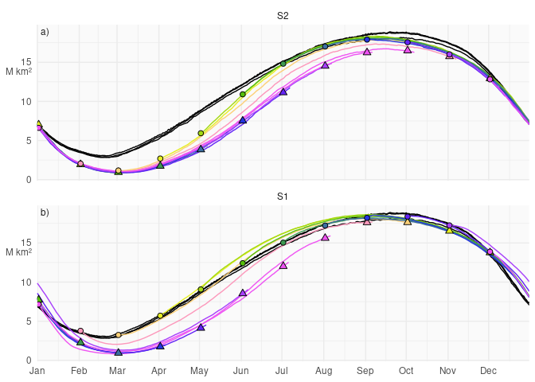
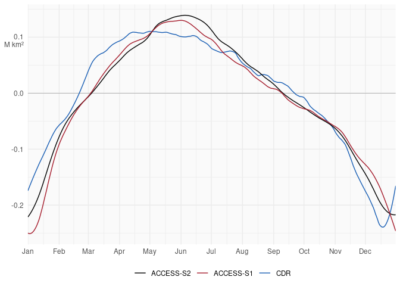
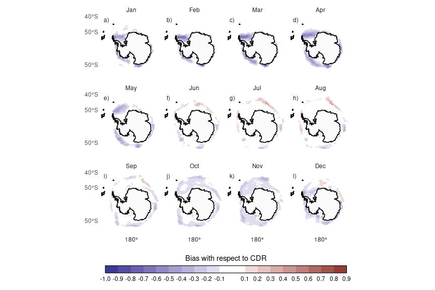
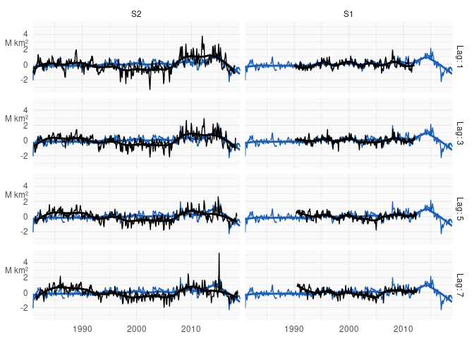
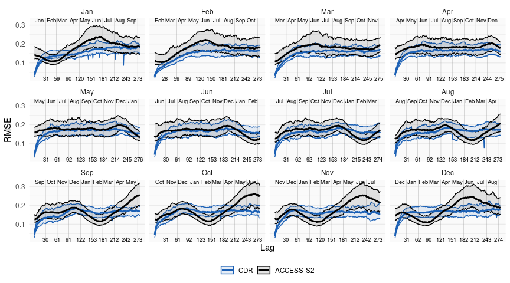
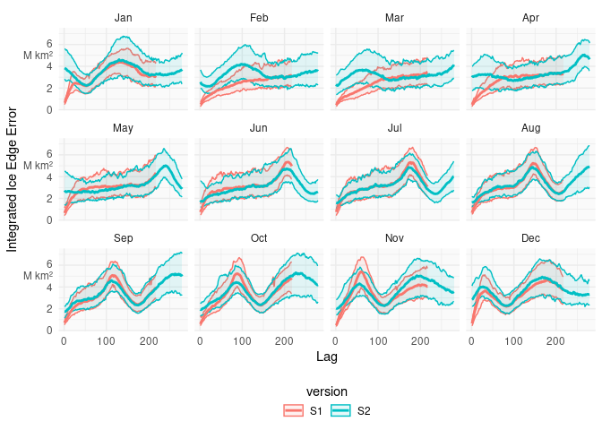
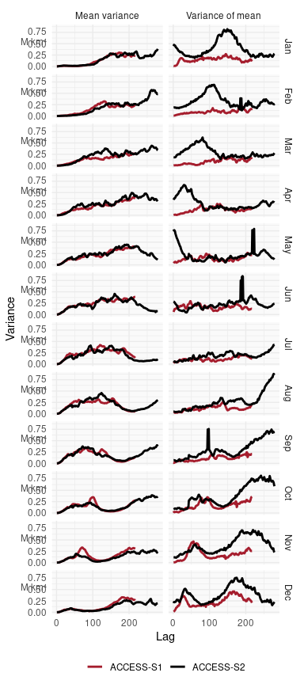

# Untitled


\IfFileExists{pdfcomment.sty}
{
  \usepackage{pdfcomment}
  \newcommand{\criticmarkupadd}[1]{\pdfmarkupcomment[markup=Highlight,color={0.838431  0.913725  0.734902}]{##1}{}}
  \newcommand{\criticmarkuprm}[1]{\pdfmarkupcomment[markup=Highlight,color={0.887059  0.673725  0.673725}]{##1}{}}
  \newcommand{\criticmarkupmark}[1]{\pdfmarkupcomment[markup=Highlight,color={1  0.99216  0.21961}]{##1}{}}
  \newcommand{\criticmarkupcomm}[1]{\pdfcomment[icon=Comment, color={0.89804  0.69020  0}]{##1}}
}{

  \newcommand{\criticmarkupadd}[1]{\{++{##1}++\}}
  \newcommand{\criticmarkuprm}[1]{\{-{}-{##1}-{}-\}}
  \newcommand{\criticmarkupmark}[1]{\{=={##1}==\}}
  \newcommand{\criticmarkupcomm}[1]{\{>{}>{##1}<{}<\}}
}


# Introduction

{==**Antarctic sea ice general description**. Seasonality, trends.==}

{==**Importance**. Impacts on life. Potential impacts on weather.
Impacts on climate. Impacts on ocean circulation.(Justify why it’s
important to study and understand)==}

{==**Prediction systems.** Why is it important: operations {\>\>Discuss
with Phil\<\<}; science needs (we need good models). What is available.
Discussion on S1 {\>\>Can we discuss previous S1 results? Laura’s paper
is not public.\<\<}==}

{==**Objective.** Evaluate S2.==}

# Data and methods

## ACCESS-S2

ACCESS-S2 (Wedd et al. 2022) is the Australian Bureau of Meteorology’s
current seasonal prediction system that replaced ACCESS-S1 (Hudson et
al. 2017) in October 2021. Both ACCESS-S2 and ACCESS-S1 consist on the
Global Atmosphere 6.0 (GA6) (Williams et al. 2015; J. Waters et al.
2017), Global Land 6.0 (Best et al. 2011; J. Waters et al. 2017), Global
Ocean 5.0 (Madec et al. 2013; Megann et al. 2014) and Global Sea Ice 6.0
\[CICE; Rae et al. (2015)\]. The atmosphere has a N216 horizontal
resolution(~60km in the mid-latitudes) with 85 levels. The land model
uses the same horizontal grid with 4 soil levels. The ocean component
has a 1/4º resolution with 75 vertical levels. The ice component –based
on CICE version 4.1– has the same resolution than the ocean and 5 sea
ice categories as well as an open water category.

Both systems took atmospheric initial conditions derived from
ERA-interim (Dee et al. 2011) for the hindcast and from the Bureau’s
operational analysis for real-time forecasts. The main difference
between the two are the ocean and ice initial conditions. ACCESS-S1
initial conditions came from from the Met Office FOAM system, which uses
a multivariate, incremental three-dimensional variational (3D-Var),
first-guess-at-appropriate-time (FGAT) DA scheme (Jennifer Waters et al.
2015) and assimilates sea surface temperature (SST), sea surface height
(SSH), in situ temperature and salinity profiles, and sea ice
concentration. ACCESS-S2, instead, runs from initial conditions
generated by the in-house data assimilation scheme described in Wedd et
al. (2022). This scheme is a weakly coupled ensemble optimal
interpolation method and assimilates temperature and salinity profiles
from EN4 (Good, Martin, and Rayner 2013) for the hindcast and from the
WMO Global Telecommunication System (GTS) and both the Coriolis and
USGODAE Global Data Assembly Centers (GDACs) for the real-time forecast.
SSTs are nudged to Reynolds OISSTv2.1 (Reynolds et al. 2007) for the
hindcast and to the Global Australian Multi-Sensor SST Analysis (GAMSSA;
Zhong and Beggs 2008) for the real-time forecast in areas where SSTs are
larger than 0ºC. Relevant for this work, sea ice concentrations are not
assimilated.

For evaluation we use hindcast for the period 1981–2023{\>\>Check\<\<}.
Anomalies will be taken with respect to the 1981–2011 climatology
computed from the reanalysis. Climatology is smoothed with a 11 day
running mean.

## Verification datasets

There is not a lot of data on sea ice properties, especially for things
like thickness, age, etc. However there are relatively reliable
satellite-derived estimates of sea ice concentration, which estimates
the proportion of each grid area that is covered with ice.

We use NOAA/NSIDC’s Climate Data Record V4 as the primary verification
dataset. Its sea ice concentration data are estimated taking the maximum
value of the NASA Team \[ref\] and NASA Bootstrap \[ref\] algorithms to
reduce their low concentration bias (Meier et al. 2014; Meier et al.
2021). Both algorithms use data from the Scanning Multichannel Microwave
Radiometer (SMMR) on the Nimbus-7 satellite and from the Special Sensor
Microwave/Imager (SSM/I) sensors on the Defense Meteorological Satellite
Program’s (DMSP) -F8, -F11, and -F13 satellites. The data has a
resolution of 25 by 25km and daily from 1978 onwards.

These data are not perfect, there still exists a fair bit of
observational uncertainty. We include other sources of data to take into
acount the observational uncertainty.

However, we find that the spread among the different datasets is minimal
compared with the difference with the ACCESS-S2 and ACCESS-S1 forecasts,
so the conclusions are independent of the dataset used. Nevertheless, we
provide figures using ERA5

The European Organisation for the Exploitation of Meteorological
Satellites (EUMETSAT) Ocean and Sea Ice Satellite Application Facility
(OSI SAF) \[ref\] is another satellite-derived sea ice concentration
product based on mostly the same sensors as the NOA CDR. We also use

Copernicus Climate Change Service (C3S) (2020): Sea ice concentration
daily gridded data from 1978 to present derived from satellite
observations. Copernicus Climate Change Service (C3S) Climate Data Store
(CDS). DOI: 10.24381/cds.3cd8b812 (Accessed on DD-MMM-YYYY)

{==From the CDS websiste:==} ERA5 is the fifth generation ECMWF
reanalysis for the global climate and weather for the past 8 decades.
Data is available from 1940 onwards. ERA5 replaces the ERA-Interim
reanalysis.

This parameter is the fraction of a grid box which is covered by sea
ice. Sea ice can only occur in a grid box which includes ocean or inland
water according to the land-sea mask and lake cover, at the resolution
being used. This parameter can be known as sea-ice (area) fraction,
sea-ice concentration and more generally as sea-ice cover. In ERA5,
sea-ice cover is given by two external providers. Before 1979 the
HadISST2 dataset is used. From 1979 to August 2007 the OSI SAF (409a)
dataset is used and from September 2007 the OSI SAF oper dataset is
used. Sea ice is frozen sea water which floats on the surface of the
ocean. Sea ice does not include ice which forms on land such as
glaciers, icebergs and ice-sheets. It also excludes ice shelves which
are anchored on land, but protrude out over the surface of the ocean.
These phenomena are not modelled by the IFS. Long-term monitoring of sea
ice is important for understanding climate change. Sea ice also affects
shipping routes through the polar regions.

{\>\>Why is ERA5 better or worse than satellites?\< \<}

### Bootstrap

{\>\>From https://nsidc.org/data/nsidc-0079/versions/4\<\<} This sea ice
concentration data set was derived using measurements from the Scanning
Multichannel Microwave Radiometer (SMMR) on the Nimbus-7 satellite and
from the Special Sensor Microwave/Imager (SSM/I) sensors on the Defense
Meteorological Satellite Program’s (DMSP) -F8, -F11, and -F13
satellites. Measurements from the Special Sensor Microwave
Imager/Sounder (SSMIS) aboard DMSP-F17 are also included. The data set
has been generated using the Advanced Microwave Scanning Radiometer -
Earth Observing System (AMSR-E) Bootstrap Algorithm with daily varying
tie-points. Daily (every other day prior to July 1987) and monthly data
are available for both the north and south polar regions. Data are
gridded on the SSM/I polar stereographic grid (25 x 25 km) and provided
in two-byte integer format. Data coverage began on 01 November 1978 and
is ongoing through the most current processing, with updated data
processed several times annually.

(Comiso 2023)

### NASA Team

{==missing==}

### CDR

NOAA/NSIDC’s Climate Data Record V4 combines the Bootstrap and NASA Team
estimates in an attempt to overcome each algorithm’s weaknesses.
{\>\>More detail on how are they combined and their properties.\<\<} As
such, it is is not a truly independent dataset.

Meier, W. N., F. Fetterer, A. K. Windnagel, and S. Stewart. 2021.
NOAA/NSIDC Climate Data Record of Passive Microwave Sea Ice
Concentration, Version 4. \[Indicate subset used\]. Boulder, Colorado
USA. NSIDC: National Snow and Ice Data Center
https://doi.org/10.7265/efmz-2t65. \[Date Accessed\] {\>\>Add to
zotero\<\<}

### ERA5

All datasets are regrided using bilinear interpolation to a common grid,
which is a polar stereographic grid with approximately equal area of
25km².

## Error measures

For evaluation purposes, we use a series of measures.

### Sea ice extent

Sea Ice Extent is defined as the area of ocean covered with at least 15%
ice. This threshold is motivated by the limitations in satellite
retrieval, which is increasingly unreliable for low sea ice conditions.

Sea Ice Extent is a rough global measure, but a model could have
relatively accurate extent of ice but with different distributions. We
use two other measures to account for these errors.

We compute Root Mean Square Error of sea ice concentration anomalies.

We also compute the Integrated Ice Edge Error (IIEE) (Goessling et al.
2016). This is defined as the area in which the model misspredicts sea
ice concentration being above or belog 15% ice. That is, dichotomise sea
ice concentration into areas with more and less than 15% sea ice both in
the forecast and observations; the IIEE is the area in which forecast
and observations differ.

# Results and discussion

## Reanalysis

### Bias



<a href="#fig-hindcast-extent" class="quarto-xref">Figure 1</a> a shows
the seasonal cycle of Sea Ice Extent for the ACCESS-S2 hindcast and 3
observational datasets. ACCESS-S2 shows a severe low extent bias,
especially in the late summer-early autumn. This is due primarily to a
faster and longer melt season between January and March and slower
growth during March and April This is then balanced with faster growth
between May and July
(<a href="#fig-mean-growth" class="quarto-xref">Fig. 2</a>). This bias
is common in climate models \[ref!\] and it’s been linked to xxxx??

Comparing ACCESS-S2 with ACCESS-S1, the latter has a smaller bias,
especially at low lags
(<a href="#fig-hindcast-extent" class="quarto-xref">Fig. 1</a>) even
though the typical growth rates are very similar between both models
(<a href="#fig-mean-growth" class="quarto-xref">Fig. 2</a>). At larger
lags, ACCESS-S1’s bias in summer and autumn is very similar to
ACCESS-S2\`s. This suggests that this lower sea ice state is closer to
the models’ equilibrium, indicating that it is an issue with model
formulation that was being corrected by the data assimilation system in
ACCESS-S1.

At long lags, sea ice extent loses most of the initial condition memory
and reverts to the model’s preferred equilibrium state. Therefore we can
estimate the latter using the hindcasts with the largest possible lag,
which is shown in triangles in
<a href="#fig-hindcast-extent" class="quarto-xref">Figure 1</a> for the
same dates as the initial conditions. The difference between the two is
the effect of the data assimilation.

The equilibrium of ACCESS-S1 and ACCESS-S2 is very similar (comparing
the triangles in each panel in
<a href="#fig-hindcast-extent" class="quarto-xref">Fig. 1</a>), owing to
both having the same model formulation. From June to October, in
ACCESS-S2 circles move away from triangles and towards observations,
indicating that the information from the ocean and atmosphere data
assimilation is getting to sea ice and affecting the initial conditions.
The rest of the year, there is little if any difference between circles
and triangles in ACCESS-S2, indicating that almost no data assimilation
is taking place and the sea ice component of the model is virtually
free-running.





<a href="#fig-bias" class="quarto-xref">Figure 3</a> shows the
difference in monthly mean sea ice concentrations between CDR and
ACCESS-S2 reanalysis. From October to May, the model underestimates sea
ice concentrations pretty much everywhere there is ice except for the
deep Weddell Sea in April and May, where sea ice concentrations saturate
to 1. In winter, the differences are mostly on the sea ice edge, with
slight positive bias in XXX and negative bias around the Indian Ocean
sector.

### Anomalies

{==intro connecting subsections==}



<a href="#fig-extent-anom" class="quarto-xref">Figure 4</a> shows
monthly sea ice extent anomalies forecasted at selected lags. The
anomalies in this case were computed with respect of the climatology of
each lag, which is a way of bias-correction. Compared with ACCESS-S1,
ACCESS-S2 anomaly forecast is relatively poor even in the first month,
which stays relatively skilful even at lag 3. ACCESS-S2 shows much
bigger variability than observations, with dramatic lows between 1995
and 2007 and highs between 2007 and 2015.

{\>\>Add regional extents?\< \<}

### RMSE

To study ACCESS-S2 forecasts quantitatively, we compute error measures
for all hindcasts started on the 1st of every month.



<a href="#fig-rmse" class="quarto-xref">Figure 5</a> shows the median
and 95% range of RMSE of sea ice concentration anomalies for ACCESS-S2
forecasts compared with a benchmark of persistence. This figure uses CDR
data, but the results are nearly identical compared with ERA5 or
Bootstrap. Due to errors in the initial conditions, it is expected that
a persistence forecast would be better than the model forecast at very
short lags, but that the persistence forecast errors would grow faster
and eventually surpass the mode forecast, at which time is statistically
useful {==I’ve got this from CC at the ICTP summer school and makes
sense, but it would be great to have a referece?= =}. Here the
persistence errors are almost always lower than the ACCESS-S2 forecast,
indicating that the model doesn’t have skill at any lag and in any
month. The only exception is the RMSE around Febraury forecasted from
June onwards.

{==Add regional?= =}

### Comparison with S1



To compare ACCESS-S2 with ACCESS-S1, we computed the IIEE for both
models. This error measure is shown in
<a href="#fig-iiee" class="quarto-xref">Figure 6</a> for all lags and
forecasts initialised at the first of every month. ACCESS-S1 has lower
error at short lags at all months, with the errors converging as the
forecast goes on. The time to convergence depends on the month and it
can be as fas as a few days in July to as large as several months for
forecasts initiated in February and March. Since the only difference
between these forecasts are the initial conditions, this timescale is an
indication of the the memory of sea ice to initial conditions; at least
from October to March when the data assimilated form the other
components has little to no influence on sea ice.

Also evident in <a href="#fig-iiee" class="quarto-xref">Figure 6</a> is
the difference in the error spread at short lags between ACCESS-S2 and
ACCESS-S1. In all month ACCESS-S1 shows a small error spread at lag 1,
indicating that the error in the initial conditions not only is small,
but also fairly constant. This spread then grows towards a
climatological spread as errors accumulate differently in different
forecasts. For ACCESS-S2, this is true only only between July and
October, approximately. For all other months, the error spread is more
or less stable throughout the forecast window, indicating that not only
the initial error is high, but it’s not constant.



The large initial error spread could be due either to large spread of
ensemble members or due to a large spread of individual forecasts.
<a href="#fig-iiee-variance" class="quarto-xref">Figure 7</a> splits the
IIEE variance for each lag into the mean variance of each individual
forecast and the variance of the mean error of each individual forecast,
which adds up to the total variance. The average variance of each
forecast is almost identical between forecast systems in all months.
This shows that the ensemble spread of individual forecasts evolves
identically, which, again, it’s not unexpected because both systems
share the same model formulation. This also shows that the perturbation
scheme in ACCESS-S2 is comparable to the one in ACCESS-S1.

On the other hand, the spread of the mean error is always larger in
ACCESS-S2 than ACCESS-S1. The difference is particularly large at short
lags in some months, which coindice with the ones in which the data
assimilation scheme is not influencing sea ice initial conditions.

## Conclusions

# References

<div id="refs" class="references csl-bib-body hanging-indent"
entry-spacing="0">

<div id="ref-best2011" class="csl-entry">

Best, M. J., M. Pryor, D. B. Clark, G. G. Rooney, R. L. H. Essery, C. B.
Ménard, J. M. Edwards, et al. 2011. “The Joint UK Land Environment
Simulator (JULES), Model Description – Part 1: Energy and Water Fluxes.”
*Geoscientific Model Development* 4 (3): 677–99.
<https://doi.org/10.5194/gmd-4-677-2011>.

</div>

<div id="ref-comiso2023" class="csl-entry">

Comiso, J. 2023. “Bootstrap Sea Ice Concentrations from Nimbus-7 SMMR
and DMSP SSM/I-SSMIS. (NSIDC-0079, Version 4).” Boulder, Colorado USA.:
NASA National Snow and Ice Data Center Distributed Active Archive
Center. <https://doi.org/10.5067/X5LG68MH013O>.

</div>

<div id="ref-dee2011" class="csl-entry">

Dee, D. P., S. M. Uppala, A. J. Simmons, P. Berrisford, P. Poli, S.
Kobayashi, U. Andrae, et al. 2011. “The ERA-Interim Reanalysis:
Configuration and Performance of the Data Assimilation System.”
*Quarterly Journal of the Royal Meteorological Society* 137 (656):
553–97. <https://doi.org/10.1002/qj.828>.

</div>

<div id="ref-goessling2016" class="csl-entry">

Goessling, H. F., S. Tietsche, J. J. Day, E. Hawkins, and T. Jung. 2016.
“Predictability of the Arctic Sea Ice Edge.” *Geophysical Research
Letters* 43 (4): 1642–50. <https://doi.org/10.1002/2015GL067232>.

</div>

<div id="ref-good2013" class="csl-entry">

Good, Simon A., Matthew J. Martin, and Nick A. Rayner. 2013. “EN4:
Quality Controlled Ocean Temperature and Salinity Profiles and Monthly
Objective Analyses with Uncertainty Estimates.” *Journal of Geophysical
Research: Oceans* 118 (12): 6704–16.
<https://doi.org/10.1002/2013JC009067>.

</div>

<div id="ref-hudson2017" class="csl-entry">

Hudson, Debra, Oscar Alves, Harry H. Hendon, Eun-Pa Lim, Guoqiang Liu,
Jing-Jia Luo, Craig MacLachlan, et al. 2017. “ACCESS-S1 The New Bureau
of Meteorology Multi-Week to Seasonal Prediction System.” *Journal of
Southern Hemisphere Earth Systems Science* 67 (3): 132–59.
<https://doi.org/10.1071/es17009>.

</div>

<div id="ref-madec2013" class="csl-entry">

Madec, Gurvan, Romain Bourdallé-Badie, Pierre-Antoine Bouttier, Clément
Bricaud, Diego Bruciaferri, Daley Calvert, Jérôme Chanut, et al. 2013.
“NEMO Ocean Engine,” February. <https://doi.org/10.5281/zenodo.1475234>.

</div>

<div id="ref-megann2014" class="csl-entry">

Megann, A., D. Storkey, Y. Aksenov, S. Alderson, D. Calvert, T. Graham,
P. Hyder, J. Siddorn, and B. Sinha. 2014. “GO5.0: The Joint NERC–Met
Office NEMO Global Ocean Model for Use in Coupled and Forced
Applications.” *Geoscientific Model Development* 7 (3): 1069–92.
<https://doi.org/10.5194/gmd-7-1069-2014>.

</div>

<div id="ref-meier2021" class="csl-entry">

Meier, Walter N., F Fetterer, A. K. Windnagel, and J. Scott Stewart.
2021. “NOAA/NSIDC Climate Data Record of Passive Microwave Sea Ice
Concentration.” Boulder, Colorado USA: National Snow and Ice Data
Center. <https://doi.org/10.7265/efmz-2t65>.

</div>

<div id="ref-meier2014" class="csl-entry">

Meier, Walter N., Ge Peng, Donna J. Scott, and Matt H. Savoie. 2014.
“Verification of a New NOAA/NSIDC Passive Microwave Sea-Ice
Concentration Climate Record.” *Polar Research*, December.
<https://doi.org/10.3402/polar.v33.21004>.

</div>

<div id="ref-rae2015" class="csl-entry">

Rae, J. G. L., H. T. Hewitt, A. B. Keen, J. K. Ridley, A. E. West, C. M.
Harris, E. C. Hunke, and D. N. Walters. 2015. “Development of the Global
Sea Ice 6.0 CICE Configuration for the Met Office Global Coupled Model.”
*Geoscientific Model Development* 8 (7): 2221–30.
<https://doi.org/10.5194/gmd-8-2221-2015>.

</div>

<div id="ref-reynolds2007" class="csl-entry">

Reynolds, Richard W., Thomas M. Smith, Chunying Liu, Dudley B. Chelton,
Kenneth S. Casey, and Michael G. Schlax. 2007. “Daily
High-Resolution-Blended Analyses for Sea Surface Temperature.” *Journal
of Climate* 20 (22): 5473–96. <https://doi.org/10.1175/2007JCLI1824.1>.

</div>

<div id="ref-waters2017" class="csl-entry">

Waters, J., M. J. Bell, M. J. Martin, and D. J. Lea. 2017. “Reducing
Ocean Model Imbalances in the Equatorial Region Caused by Data
Assimilation.” *Quarterly Journal of the Royal Meteorological Society*
143 (702): 195–208. <https://doi.org/10.1002/qj.2912>.

</div>

<div id="ref-waters2015" class="csl-entry">

Waters, Jennifer, Daniel J. Lea, Matthew J. Martin, Isabelle Mirouze,
Anthony Weaver, and James While. 2015. “Implementing a Variational Data
Assimilation System in an Operational 1/4 Degree Global Ocean Model.”
*Quarterly Journal of the Royal Meteorological Society* 141 (687):
333–49. <https://doi.org/10.1002/qj.2388>.

</div>

<div id="ref-wedd2022" class="csl-entry">

Wedd, Robin, Oscar Alves, Catherine de Burgh-Day, Christopher Down,
Morwenna Griffiths, Harry H. Hendon, Debra Hudson, et al. 2022.
“ACCESS-S2: The Upgraded Bureau of Meteorology Multi-Week to Seasonal
Prediction System.” *Journal of Southern Hemisphere Earth Systems
Science* 72 (3): 218–42. <https://doi.org/10.1071/ES22026>.

</div>

<div id="ref-williams2015" class="csl-entry">

Williams, K. D., C. M. Harris, A. Bodas-Salcedo, J. Camp, R. E. Comer,
D. Copsey, D. Fereday, et al. 2015. “The Met Office Global Coupled Model
2.0 (GC2) Configuration.” *Geoscientific Model Development* 8 (5):
1509–24. <https://doi.org/10.5194/gmd-8-1509-2015>.

</div>

</div>

# Suplementary figures

<!-- ## ERA5 -->
<!-- ```{r dataset_era} -->
<!-- which_dataset <- "era5" -->
<!-- ``` -->
<!-- ```{r fig-hindcast-extent-era5} -->
<!-- which_dataset <- "era5" -->
<!-- <<fig-hindcast-extent>> -->
<!-- ``` -->
<!-- ```{r fig-hindcast-extent-bt} -->
<!-- which_dataset <- "bt" -->
<!-- <<fig-hindcast-extent>> -->
<!-- ``` -->
<!-- ```{r fig-mean-growth} -->
<!-- <<fig-mean-growth>> -->
<!-- ``` -->
<!-- ```{r} -->
<!-- <<fig-bias>> -->
<!-- ``` -->
<!-- ```{r} -->
<!-- <<<fig-extent-anom>> -->
<!-- ``` -->
<!-- ```{r} -->
<!-- <<fig-rmse>> -->
<!-- ``` -->
<!-- ```{r} -->
<!-- <<fig-iiee>> -->
<!-- ``` -->
<!-- ```{r} -->
<!-- <<fig-iiee-variance>> -->
<!-- ``` -->
